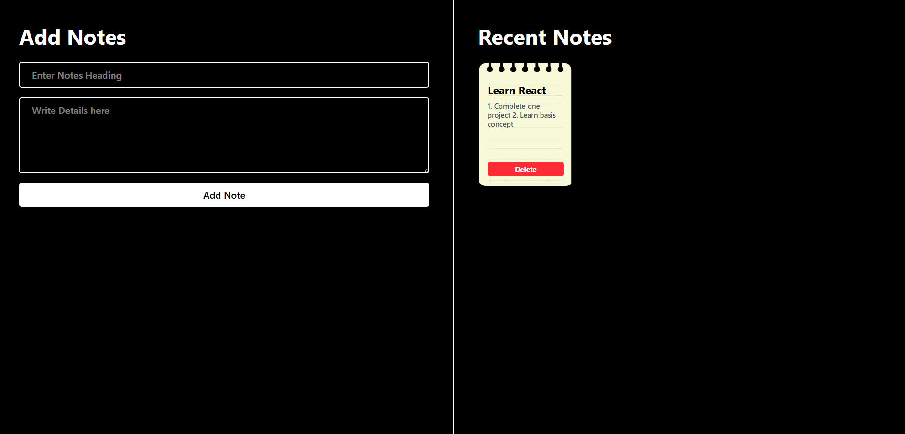

# 📝 Note App

A simple and responsive **Note Taking Application** built with **React.js** and **Tailwind CSS**. The application allows users to create, view, and delete notes through a clean and user-friendly interface.

---

## 🚀 Features

- ➕ Add new notes with a title and description
- 📋 Display all notes dynamically
- 🗑️ Delete notes instantly
- ⚡ Real-time UI updates using React Hooks
- 🎨 Responsive and modern UI with Tailwind CSS
- 💻 Beginner-friendly React project

---

## 🛠️ Tech Stack

- React.js
- JavaScript (ES6+)
- Tailwind CSS
- HTML5
- CSS3
- Vite

---

## 📸 Preview

### Home Page



---

## ⚙️ Installation

Clone the repository:

```bash
git clone https://github.com/Nitul7/Note-app.git
```

## 📖 Usage

1. Enter a **Note Title**.
2. Write the note details.
3. Click **Add Note**.
4. Your note will appear in the **Recent Notes** section.
5. Click **Delete** to remove any note.

---

## 📚 What I Learned

- React Functional Components
- React Hooks (`useState`)
- State Management
- Event Handling
- Controlled Components
- Dynamic Rendering using `map()`
- Array Manipulation (`push()` and `splice()`)
- Responsive UI Design with Tailwind CSS

---

## 🔮 Future Improvements

- ✏️ Edit existing notes
- 💾 Store notes using Local Storage
- 🔍 Search notes
- 📌 Pin important notes
- 🌙 Dark/Light Mode
- 🗂️ Note Categories
- 📅 Date & Time for each note

---

## 🤝 Contributing

Contributions are welcome!

1. Fork this repository.
2. Create a new branch.

```bash
git checkout -b feature-name
```

3. Commit your changes.

```bash
git commit -m "Add new feature"
```

4. Push to your branch.

```bash
git push origin feature-name
```

5. Open a Pull Request.

---

## 👨‍💻 Author

**Nitul Tako**

- GitHub: https://github.com/Nitul7

---

## ⭐ Support

If you found this project helpful, please consider giving it a ⭐ on GitHub!
